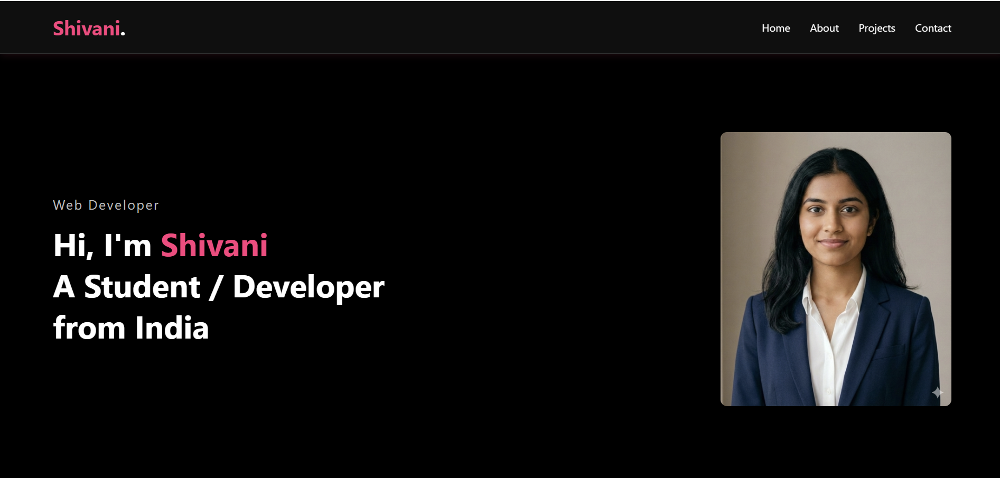
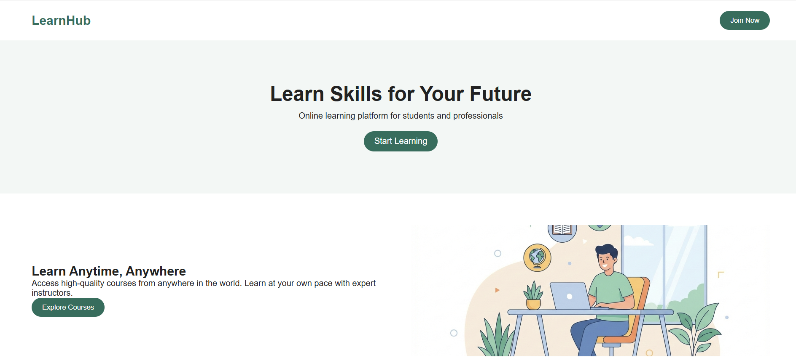

## OIBSIP_WebDev_Task2 - Portfolio Website

## Objective
Create a personal portfolio website using HTML, CSS, and basic JavaScript.
This project helps beginners showcase their skills, projects, and contact details while learning layout design, styling, and simple interactivity.

## Tools Used
- HTML5
- CSS3
- JavaScript (for tab switching)
- Google Fonts
- VS Code (Code Editor)
- Chrome / Firefox (Browser)

## Features
- Personal introduction section with name and image
- About Me section describing skills and background
- Skills section highlighting technical abilities
- Projects section to showcase work samples
- Contact section with basic contact details
- Tab-based navigation using JavaScript
- Clean and responsive layout
- Simple and beginner-friendly UI design
- 
## Files Included
- portfolio.html – Structure of the portfolio website
- portfolio.css – Styling, layout, fonts, and responsiveness
- portfolio.js – JavaScript for tab switching functionality

## Steps Performed
1. Created portfolio.html to structure sections like About, Skills, Projects, and Contact.
2. Styled the website using portfolio.css for layout, colors, fonts, and spacing.
3. Implemented tab switching using portfolio.js to show and hide content dynamically.
4. Added images and content to make the portfolio visually appealing.
5. Tested the website in different browsers and screen sizes for responsiveness.

## Outcome
- Fully functional personal portfolio website
- Smooth tab switching without page reload
- Clean and organized presentation of information
- Responsive design suitable for desktop and mobile screens
- Demonstrates basic HTML, CSS, and JavaScript skills

## Screenshots

## GitHub Repository
https://github.com/mandavkarshivani198-del/OIBSIP_WebDevelopment_L1_Task2

## Demo Video 
https://www.linkedin.com/posts/shivani-mandavkar-6b78743a8_portfolio-webdevelopment-oibsip-activity-7427381190250086402-Mb8k?utm_source=share&utm_medium=member_desktop&rcm=ACoAAGPLtesB_hTu1XrS9NiuYPIZ8GFThYiBuqk

## LinkedIn Post
https://www.linkedin.com/posts/shivani-mandavkar-6b78743a8_oibsip-oasisinfobyte-aicte-share-7426712255557271552-QeFy?utm_source=share&utm_medium=member_desktop&rcm=ACoAAGPLtesB_hTu1XrS9NiuYPIZ8GFThYiBuqk

## Note:
This README serves as the official documentation for Level 1 – Task 2 (Portfolio Website) under the OIB-SIP Web Development Internship. All required files (HTML, CSS, JavaScript, and images) are included in the repository for evaluation.
